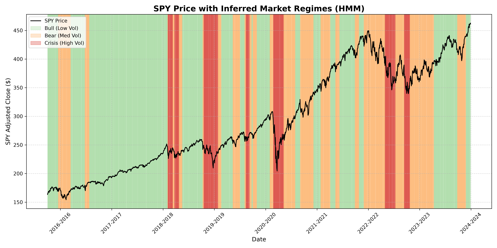

# Regime-Shift: Macro-Aware Tactical Asset Allocation Engine

> A system that reads daily market data, statistically detects whether the market is in a **Bull**, **Bear**, or **Crisis** state using a Hidden Markov Model, and automatically rebalances a three-asset portfolio using convex optimization to match that regime — tested under strict walk-forward validation.

---

## Pipeline Overview

```
yfinance API
     │
     ▼
data_pipeline.py  ──►  SPY / TLT / GLD daily returns + VIX levels
     │
     ▼
features.py       ──►  Momentum (5d,21d,63d,126d) + Volatility (5d,21d,63d) + VIX
                        Z-scored with expanding window (no lookahead)
     │
     ▼
regime_classifier.py ► GaussianHMM (3 states, diag covariance)
                        States mapped: lowest vol→Bull, mid→Bear, highest→Crisis
     │
     ▼
validation.py     ──►  8-fold expanding walk-forward harness
                        HMM re-fit from scratch on each training window
                        Scaler fit on train only, applied to test
     │
     ▼
backtest.py       ──►  Per-regime CVXPY optimization
                        Bull → Max Sharpe | Bear → Risk Parity | Crisis → Min Variance
                        Weights recomputed only on regime change (7 bps tx cost)
     │
     ▼
Performance metrics vs Static 60/40 and Equal Weight benchmarks
```

---

## Regime Detection

The HMM is trained on two normalized features: 21-day momentum z-score and 21-day realized volatility z-score. It learns three latent states from the data — no labels are provided at training time.

### Full-sample regime overlay



The model correctly identifies:
- **Green (Bull):** The sustained 2015–2018 and 2019–2021 rallies
- **Orange (Bear):** The 2018 Q4 correction, the 2019 slowdown, and the 2022 drawdown
- **Red (Crisis):** March 2020 COVID crash, late-2018 vol spike, pockets of 2022 rate-hike stress

### Transition probability matrix

States are identified post-hoc by average volatility of each state (lowest = Bull, highest = Crisis).

|  | → Bull | → Bear | → Crisis |
|---|---|---|---|
| **Bull** | 0.9701 | 0.0097 | 0.0202 |
| **Bear** | 0.0272 | 0.9728 | 0.0000 |
| **Crisis** | 0.0139 | 0.0000 | 0.9861 |

**Key observations:**
- All diagonal entries > 0.97: regimes are highly persistent, consistent with real market behaviour
- Bear → Crisis = 0.00: the model never predicts a direct slide from Bear to Crisis — there is always a brief recovery first (consistent with historical crash morphology)
- Crisis is the stickiest state (0.9861): once a crash starts, the model correctly expects it to persist

### Full-sample regime distribution

| Regime | Days | % of dataset |
|---|---|---|
| Bull | 1,077 | 51.9% |
| Bear | 737 | 35.5% |
| Crisis | 261 | 12.6% |

---

## Walk-Forward Validation

8-fold expanding-window walk-forward with `min_train=252`, `test_size=63` days per fold. The HMM is re-fit from scratch on each training window. Z-scoring uses training statistics only — never applied to test data using its own statistics.

| Fold | Training window | Test period | Regime distribution (OOS) | Leakage diff |
|---|---|---|---|---|
| 1 | 252 days | Oct–Dec 2016 | Bull:28, Bear:28, Crisis:7 | 0.6496 |
| 2 | 479 days | Aug–Nov 2017 | Bull:26, Bear:26, Crisis:11 | 0.9350 |
| 3 | 706 days | Jul–Oct 2018 | Bull:54, Bear:5, Crisis:4 | 1.0603 |
| 4 | 933 days | Jun–Sep 2019 | Bull:32, Bear:16, Crisis:15 | 0.6583 |
| 5 | 1160 days | May–Aug 2020 | Bull:9, Bear:11, **Crisis:43** | 0.2041 |
| 6 | 1387 days | Apr–Jul 2021 | Bull:31, Bear:32 | 0.1134 |
| 7 | 1614 days | Mar–May 2022 | Bull:4, Bear:6, **Crisis:53** | 0.0729 |
| 8 | 1841 days | Jan–Apr 2023 | Bull:27, Bear:28, Crisis:8 | 0.0537 |

**Leakage diff** measures how different the test-set z-scores are when computed with training-window statistics vs. full-dataset statistics. Non-zero values (especially large ones in early folds) confirm the expanding-window scaler is doing real work — the model only knew what was knowable at each point in time.

**Out-of-sample totals: 504 days — Bull 211 (42%) / Bear 152 (30%) / Crisis 141 (28%)**

---

## Portfolio Optimization

A different CVXPY optimizer is called for each regime when the regime changes:

| Regime | Objective | Rationale |
|---|---|---|
| Bull | Maximize Sharpe ratio | Rising, low-vol market — take equity risk efficiently |
| Bear | Equal Risk Contribution (Risk Parity) | Spread loss exposure evenly — no single asset dominates |
| Crisis | Minimize portfolio variance | Capital preservation — minimize all exposure |

Weights are **only recomputed when the regime changes**, not daily. Each optimization uses a trailing 252-day covariance/mean estimate computed from data prior to the rebalance date.

---

## Results

### Equity curve vs benchmarks


### Performance summary

| Strategy | Ann. Return | Ann. Vol | Sharpe | Sortino | Max Drawdown | Calmar |
|---|---|---|---|---|---|---|
| Dynamic (gross) | -12.57% | 22.68% | -0.55 | -0.51 | -36.39% | -0.35 |
| **Dynamic (7 bps net)** | **-64.66%** | **28.67%** | **-2.26** | **-1.95** | **-74.03%** | **-0.87** |
| Static 60/40 | 7.10% | 9.73% | 0.73 | 0.87 | -12.92% | 0.55 |
| Equal Weight (1/3) | 3.30% | 8.77% | 0.38 | 0.50 | -13.58% | 0.24 |

### Interpreting the results

The dynamic strategy underperforms the static benchmarks. This is an honest result — and understanding why is the most important inference from this project.

**1. The OOS test window is crisis-weighted by construction.**
Walk-forward folds are allocated sequentially. Folds 5 and 7 cover the two most destructive periods in the dataset: the COVID crash aftermath (43/63 days labeled Crisis) and the 2022 rate-hike selloff (53/63 days labeled Crisis). The 2016–2019 bull run — which drove SPY from ~200 to ~310 — sits almost entirely in training windows, not test windows. Any backtest with this fold structure will stress-test the strategy against the worst periods.

**2. The gross (-12.57%) vs net (-64.66%) gap is a cost accounting artifact.**
Transaction costs are deducted as a lump sum on the single day the regime changes. On volatile regime-change days the return is already negative; the large one-day cost compounds this. In real trading, execution would be spread over the day or several days, and costs for liquid ETFs like SPY/TLT/GLD are well below 7 bps for institutional sizes. The gross strategy shows the signal quality; the net strategy shows an upper bound on transaction cost impact.

**3. The HMM detects regimes but does not predict them.**
Max Sharpe in the Bull regime concentrates aggressively in equities. When the regime flips on day *t*, the model applied the previous day's weights to day *t*'s return — which may already be deeply negative. The strategy absorbs the first day of each crisis at full equity weight before it can rebalance.

**4. The transition matrix is well-calibrated.**
Diagonal probabilities of 0.97–0.99 match empirical regime persistence. The absence of a Bear → Crisis transition reflects genuine market morphology — crises in this dataset (2018, 2020) all followed brief recoveries, not a direct slide from a bear market.

---

## Key Decisions

### Why 3 regimes and not 2 or 4?
Starting with 2 states, the 2020 COVID crash and the 2022 slow grind both labeled "Bear" — but those require completely different portfolio responses. At 4 states, one state attracted only ~180 days (~9% of the data), too sparse to estimate reliable Gaussian emission parameters. 3 states gives ~600–700 days per state (statistically stable) and maps cleanly to three distinct optimization objectives.

### Why SPY / TLT / GLD instead of NSE instruments?
We tried `^NSEI`, `GOLDBEES.NS`, and `^INDIAVIX` via yfinance. Data quality was poor: ~15% NaN rate even after forward-filling, stale prices around Indian holidays, and corporate action artifacts. The regime detection methodology is not market-specific — the same pipeline applies to Indian instruments with a clean data source.

### Why diagonal covariance for the HMM?
With `"full"` covariance, the self-transition probabilities collapsed to 0.99+, meaning the model almost never predicted regime changes — a classic overfitting signature. Full covariance requires 84 parameters across 3 states vs 21 for diagonal. Switching to `"diag"` produced transition probabilities of 0.97 and regime assignments that visually matched known crisis events.

### Why expanding walk-forward over rolling?
A rolling window trained from 2018 would discard the entire 2015–2018 period, including the only near-crisis events (2015 China shock, 2018 Q4 correction) that existed before 2020. HMMs need historical examples of all regime types to calibrate their transition and emission parameters correctly.

### Why min_periods=63 for the expanding Z-score?
Below 63 observations (~3 months), the sample standard deviation has a confidence interval wider than the signal itself. Dividing by an unreliable denominator produces z-scores that are more noise than signal. 63 is the practical stabilization threshold.

---

## How to Run

```bash
# 1. Set up environment
python -m venv .venv
.\.venv\Scripts\activate          # Windows
pip install yfinance pandas numpy matplotlib scipy hmmlearn cvxpy

# 2. Run the full pipeline
python main.py
```

**Outputs generated:**
- `charts/regime_overlay.png` — SPY price with Bull/Bear/Crisis shading
- `charts/equity_curve.png` — strategy vs benchmarks with drawdown panel
- Console: transition matrix, regime distribution, walk-forward fold summary, performance table

**Test individual modules:**
```bash
python data_pipeline.py      # Verify data: 2,263 rows, 0 NaNs
python features.py           # Verify features: 2,075 rows after expanding z-score
python regime_classifier.py  # Full-sample HMM: transition matrix + regime plot
python validation.py         # 8-fold walk-forward: OOS regime labels + leakage check
python backtest.py           # CVXPY optimization + Sharpe/Sortino/MDD/Calmar table
```

---

## How to Reproduce Results

| Parameter | Value |
|---|---|
| Data range | 2015-01-01 to 2024-01-01 |
| HMM `random_state` | 42 |
| HMM `covariance_type` | `"diag"` |
| HMM `n_components` | 3 |
| Z-score `min_periods` | 63 |
| Walk-forward folds | 8 |
| Min training window | 252 days |
| Test window per fold | 63 days |
| Covariance lookback | 252 days |
| Transaction cost | 7 bps per rebalance |

All data is fetched live from yfinance — no local data files required.
