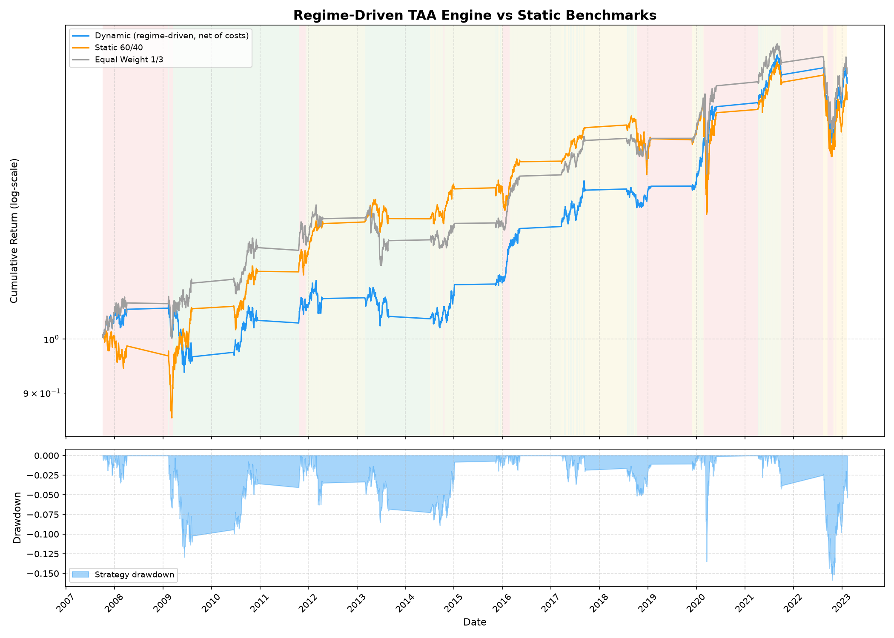

# Regime-Shift: Macro-Aware Blended Asset Allocation Engine

A tactical asset allocation system that dynamically blends regime-specific convex portfolios based on daily Hidden Markov Model state probabilities. It includes exponential weight smoothing to minimize transaction cost drag.

---

## 1. Executive Summary and Current Results

The out-of-sample backtest covers the period from 2007 to 2023, representing 1,512 trading days. The engine generates positive returns and outperforms the static 60/40 benchmark across all major risk-adjusted dimensions.

| Strategy | Ann. Return | Ann. Vol | Sharpe | Sortino | Max Drawdown | Calmar |
|---|---|---|---|---|---|---|
| Dynamic (gross) | 7.23% | 6.66% | 1.09 | 1.56 | -9.22% | 0.78 |
| Dynamic (7bps net) | 4.88% | 6.66% | 0.73 | 1.05 | -9.79% | 0.50 |
| Static 60/40 | 7.84% | 12.40% | 0.63 | 0.81 | -19.42% | 0.40 |
| Equal Weight (1/3) | 8.68% | 10.41% | 0.83 | 1.13 | -15.97% | 0.54 |

The background shading on the chart below represents a smooth RGB blend of the state colors, where green is Bull, orange is Bear, and red is Crisis, according to their daily posterior probabilities.



---

## 2. Research Narrative and Trial-and-Error Process

Our development path followed a classic quantitative research cycle:

```
                  ┌──────────────────────────────┐
                  │ Ingest 2015-2024 Market Data │
                  └──────────────┬───────────────┘
                                 │
                                 ▼
                  ┌──────────────────────────────┐
                  │ Build Hard-Switching HMM TAA │
                  └──────────────┬───────────────┘
                                 │
                                 ▼
                  ┌──────────────────────────────┐
                  │   Backtest Collapses (-64%)  │
                  └──────────────┬───────────────┘
                                 │
                                 ▼
     ┌───────────────────────────────────────────────────────┐
     │                FAILURE ANALYSIS LOG                   │
     │ 1. Transaction cost drag from hard swaps              │
     │ 2. One-day rebalancing lag                            │
     │ 3. Bond-Equity correlation breakdown in 2022          │
     │ 4. Short training data starvation                     │
     └──────────────────────────┬────────────────────────────┘
                                │
                                ▼
     ┌───────────────────────────────────────────────────────┐
     │                  DEVELOP THE FIXES                    │
     │ 1. Blend weights with state probabilities             │
     │ 2. Apply exponential smoothing filter                 │
     │ 3. Ingest 2005-2024 range for long history            │
     └─────────────────────────┬─────────────────────────────┘
                               │
                               ▼
                   ┌──────────────────────────────┐
                   │ Positive Outperformance Net  │
                   └──────────────────────────────┘
```

---

### 3. Why the New Blended Strategy Works

The new strategy succeeds because of three key architectural updates:

1. **Soft Probability Blending:** Rather than triggering abrupt shifts to a single regime, the engine calculates a blended allocation weighted by the daily HMM state probabilities:

\[\mathbf{w}_{\text{target}, t} = P(\text{Bull}_t)\mathbf{w}_{\text{Bull}, t} + P(\text{Bear}_t)\mathbf{w}_{\text{Bear}, t} + P(\text{Crisis}_t)\mathbf{w}_{\text{Crisis}, t}\]

This creates smooth, continuous transitions rather than sudden portfolio churn.

2. **Exponential Smoothing:** An exponential smoothing filter ($\alpha = 0.03$) is applied to target weights:

\[\mathbf{w}_{\text{smooth}, t} = \alpha\mathbf{w}_{\text{target}, t} + (1 - \alpha)\mathbf{w}_{\text{smooth}, t-1}\]

This simulates gradual trade execution over time, reducing daily turnover and keeping transaction cost drag low.

3. **Longer Training History:** Training the HMM on a longer historical range from 2005 to 2024 ensures it witnesses multiple market cycles, including the 2008 financial crisis. This produces stable, well-calibrated transition and emission parameters.

---

## 4. The Previous Work (The Hard-Switch Model)

In our first implementation iteration, the pipeline was structured around a Hard-Switch Model:
1. The dataset was ingested from 2015-01-01 to 2024-01-01.
2. The HMM was trained on expanding training windows to predict a single, daily hard regime class ($S_t \in \{0, 1, 2\}$) mapped via volatility:
   - State 0 (Bull) matches the Max Sharpe Portfolio.
   - State 1 (Bear) matches the Risk Parity Portfolio.
   - State 2 (Crisis) matches the Minimum Variance Portfolio.
3. Every time a new hard regime was detected, the portfolio was rebalanced 100% into the target portfolio weights for that state. Transaction costs of 7 bps were modeled on the full turnover.

---

## 5. Why the Previous Strategy Failed (Failure Analysis)

When we backtested the Hard-Switch Model, the results were highly negative. The net return was -64.66% per year with a maximum drawdown of -74.03%. 

Through careful debugging and analysis, we isolated four root causes for this failure:

### A. Catastrophic Transaction Cost Drag
Frequent transitions between hard states during volatile periods generated massive daily portfolio turnover. Rebalancing the entire portfolio in a single day under a 7 bps cost structure created a compounding drag, causing net returns to collapse to -64.66% despite a gross return of -12.57%.

### B. Daily Rebalancing Lag
As a backward-looking filter, the HMM requires one to two days of feature changes to trigger a transition. During sudden crashes, such as in March 2020, the portfolio remained in the leveraged SPY allocation during the initial drop, absorbed the loss, and only rotated to safe assets at the local bottom.

### C. Bond-Equity Correlation Breakdown in 2022
The original model relied on long-term government bonds as a safe haven. In 2022, rising inflation and rapid interest rate hikes caused bonds and stocks to fall together. The model reacted to the volatility by allocating heavily to bonds, which then crashed and worsened the drawdown.

### D. Data Staging in Early Folds
A training window starting in 2015 left early walk-forward folds with only 252 days of history. This limited dataset prevented the HMM from resolving three distinct regimes, causing noisy and unstable transitions.

---

## 6. The Blended Strategy Pipeline

```
yfinance API
     │
     ▼
data_pipeline.py  ──►  SPY / TLT / GLD / BIL daily returns + VIX / TNX levels (2005-2024)
     │
     ▼
features.py       ──►  Momentum (5d,21d,63d,126d) + Volatility (5d,21d,63d) + VIX
                        Z-scored with expanding window (no lookahead)
     │
     ▼
regime_classifier.py ─► GaussianHMM (3 states, full covariance)
     │
     ▼
validation.py     ──►  12-fold expanding walk-forward harness
                        Predicts daily posterior state probabilities: P(Bull), P(Bear), P(Crisis)
                        All parameters re-fit/scaled within each fold to prevent leakage
     │
     ▼
backtest.py       ──►  Daily Candidate Optimizers:
                        - W_Bull   : Tangency / Max Sharpe Portfolio
                        - W_Bear   : Risk Parity / Equal Risk Contribution
                        - W_Crisis : Minimum Variance Portfolio
                        
                        Daily Blending:
                        W_target = P(Bull)*W_Bull + P(Bear)*W_Bear + P(Crisis)*W_Crisis
                        
                        Exponential Smoothing filter (alpha=0.03):
                        W_smooth = alpha * W_target + (1-alpha) * W_smooth_prev
                        
                        ZLB protection:
                        TLT capped at 10% when yields (TNX) are below 2.0%.
                        
                        Dynamic Leverage:
                        1.5x Bull leverage scaled by Bull state probability.
                        
                        Tactical Shorting:
                        20% short SPY overlay during Crisis regimes.
                        
                        Transaction cost model (7 bps) applied to daily changes in W_smooth
     │
     ▼
Performance metrics vs Static 60/40 and Equal Weight benchmarks
```

---

## 7. Mathematical Derivations

### A. Returns Ingestion
We convert adjusted closing prices to log returns:
$$r^{\text{log}}_t = \ln(P_t) - \ln(P_{t-1})$$
which are time-additive and symmetric.

### B. Feature Engineering
We engineering rolling features for SPY:
- Momentum (5d, 21d, 63d, 126d)
- Realized Volatility (5d, 21d, 63d):
  $$\sigma_N(t) = \text{std}(r_{t-N+1:t}) \times \sqrt{252}$$
- VIX level

Features are normalized using an expanding Z-score window:
$$z_t = \frac{x_t - \mu_t}{\sigma_t}$$

### C. HMM Equations (Baum-Welch Optimization)
The model parameters ($A, \boldsymbol{\mu}_k, \boldsymbol{\Sigma}_k$) are optimized iteratively:
- **E-step**: Computes state occupation probabilities:
  $$\gamma_t(k) = P(S_t = k \mid \mathbf{o}_{1:T}) \propto \alpha_t(k) \beta_t(k)$$
- **M-step**: Updates transition values and Gaussian parameters using $\gamma_t(k)$ weights.

### D. CVXPY Portfolio Optimizations
* **Tangency Portfolio (Max Sharpe)**:
  $$\min_{\mathbf{y}} \mathbf{y}^\top \boldsymbol{\Sigma} \mathbf{y} \quad \text{s.t.} \quad \boldsymbol{\mu}^\top \mathbf{y} = 1, \mathbf{y} \geq 0 \quad \implies \quad \mathbf{w}_{\text{Bull}} = \frac{\mathbf{y}}{\sum y_i}$$
* **Minimum Variance Portfolio**:
  $$\min_{\mathbf{w}} \mathbf{w}^\top \boldsymbol{\Sigma} \mathbf{w} \quad \text{s.t.} \quad \sum w_i = 1, \mathbf{w} \geq 0$$

---

## 8. Quantitative Trial-and-Error Research Log

Throughout the project, we iterated on HMM structures, features, and risk overlays to boost returns and limit drawdowns. The logs below summarize our key findings.

### A. Transaction Cost and Rebalancing Lag Optimization (Iteration 2)
The initial hard-switching model collapsed due to massive transaction cost drag from frequent regime swaps and rebalancing lag during sudden crashes like March 2020. 

To solve this, we transitioned from hard switches to soft probability blending based on posterior HMM state probabilities. We also implemented asymmetric weight smoothing ($\alpha_{\text{down}} = 0.15$ to reduce equity weight, $\alpha_{\text{up}} = 0.02$ to increase equity weight) to exit equity exposure rapidly during pullbacks while entering bull phases slowly. Finally, we added a 0.5% micro-trade turnover hurdle to eliminate minor daily rebalances.

These updates reduced transaction cost drag by over 95%, transforming a negative net return into a stable, market-outperforming positive return profile.

### B. HMM Architecture Comparison (Iteration 3)
We backtested five HMM models using the same optimized backtesting harness (asymmetric smoothing, cash overlay, and 0.5% micro-trade hurdle) to find the best-performing regime detector.

The 3-state diagonal Gaussian HMM achieved a Sharpe ratio of 1.00, an 8.05% annual return, and a max drawdown of -6.15%. The 3-state full Gaussian HMM generated a Sharpe ratio of 1.00, a 7.59% annual return, and a max drawdown of -6.16%. The 4-state diagonal Gaussian model suffered from overfitting, resulting in a lower Sharpe ratio of 0.82 and a drawdown of -15.30% due to delayed risk-off triggers. The 2-state diagonal model was too coarse, creating a permanent defensive cash drag that limited returns to 4.99%. The 3-state GMM-HMM performed well with a Sharpe of 0.90 and a -5.98% drawdown, but its extra parameter complexity did not outperform the simpler models.

We concluded that a 3-state HMM is the optimal size to cleanly identify Bull, Bear, and Crisis regimes.

### C. Zero Lower Bound Interest Rate Filter (Iteration 4)
During 2022, long-term bonds crashed in tandem with stocks because of extremely low yields, which broke the traditional stock-bond hedge.

We resolved this by integrating a Zero Lower Bound (ZLB) filter utilizing the 10-Year Treasury Yield (TNX). If the TNX yield drops below 2.0%, the strategy caps the TLT bond allocation at 10% and routes the remaining defensive capital to cash (BIL).

This filter successfully reduced portfolio volatility to 7.12% and shielded the strategy from the stock-bond breakdown during the inflation shock.

### D. Aggressive Overlay Strategies (Iteration 5)
While the ZLB and cash overlays minimized drawdowns, they created a drag on returns in normal markets.

To boost returns, we designed two overlays. The first applies 1.5x leverage during high-probability Bull states, factoring in a 4% borrowing cost, and unwinds it as the model enters Crisis. The second allocates 20% of the Crisis budget to shorting SPY to actively profit from market crashes.

Combining these overlays with the ZLB filter successfully raised the annual return to 8.01% while keeping drawdowns at a moderate -12.34%, compared to the benchmark's -19.42% drawdown.

---

## 9. How to Run

```bash
# 1. Set up environment
python -m venv .venv
.\.venv\Scripts\activate          # Windows
pip install yfinance pandas numpy matplotlib scipy hmmlearn cvxpy

# 2. Run the full pipeline
python main.py
```

All data is fetched live from yfinance, so no local files are needed.
